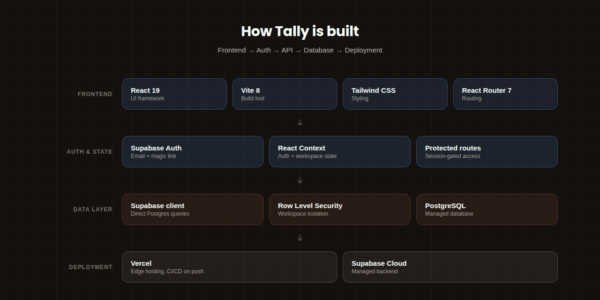

<div align="center">


<br/>


<br/><br/>


</div>

<br/>

> **Tally** is a private, bespoke personal finance application built exclusively for a single household. Designed for seamless use across mobile and desktop, Tally gives two partners — **Luke** and **Ashleigh** — an intimate, secure space to track, categorize, and manage shared and personal expenses.
>
> This is not a public product. There is no sign-up, no multi-tenant support, and no plan to onboard anyone else. It is a fully custom tool, built for one couple's financial clarity, and nothing more than that.

<br/>

## Table of contents

- [Project overview](#project-overview)
- [Features](#features)
- [Technology stack](#technology-stack)
- [Architecture](#architecture)
- [Database](#database)
- [Security](#security)
- [Installation](#installation)
- [Environment variables](#environment-variables)
- [Scripts](#scripts)
- [Project structure](#project-structure)
- [API & external services](#api--external-services)
- [Design system](#design-system)
- [Deployment](#deployment)
- [Performance](#performance)
- [Roadmap](#roadmap)
- [Contributing](#contributing)
- [Development standards](#development-standards)
- [Troubleshooting](#troubleshooting)

<br/>

## Project overview

### What Tally is

Tally is a **household-only budgeting and expense-tracking application** that lets Luke and Ashleigh:

- Log income and expenses
- Organize transactions by category
- Track budgets over time
- Distinguish between personal and shared spending
- Access a unified financial view from any device — phone, tablet, or desktop

### Why it exists

Most personal finance tools are built for mass-market use — complex onboarding, multi-user organizations, feature bloat aimed at growth metrics rather than clarity. Tally exists to be the opposite of that:

- A **minimal, focused** experience for one household
- Full **data ownership and control**, on infrastructure we run ourselves
- A system tuned precisely to **how this couple actually spends and thinks about money**

### The problem it solves

- Fragmented spending scattered across accounts and cards
- No single shared view of household finances
- Generic budgeting apps that don't reflect how this specific household actually works
- A lack of privacy and control in most consumer finance apps

### Who it's for

| | |
|---|---|
| **Primary users** | Luke and Ashleigh — one household |
| **Secondary users** | None. The system is intentionally not multi-tenant. |

### Core philosophy

- 🔒 **Private by design** — no public sign-up, no distribution
- 🧭 **Simplicity over features** — only what directly improves financial clarity
- 🛠️ **Owner-operated infrastructure** — full control over auth, data, and deployment
- 📱 **Cross-platform consistency** — the same experience on phone, tablet, and desktop

### What makes it different

- Built for **exactly two users** — not scaled toward hypothetical future ones
- Tightly coupled to one household's real workflow and mental model, not a generic template
- Hosted on a dedicated Supabase project under full owner control
- No telemetry, no ads, no third-party monetization of any kind

### Where this is headed

Tally is meant to become a **stable, low-maintenance system** that reliably serves this household for years — adding only what materially improves clarity, accuracy, or ease of use, and staying small enough that the entire codebase can be understood end-to-end by the people who maintain it.

<br/>

## Features

### 🔐 Authentication & accounts

- Email + password authentication via Supabase Auth
- Two fixed user accounts:
  - **Luke** — `clineluke39@gmail.com`
  - **Ashleigh** — `ashleighcline2006@gmail.com`
- Session management via the Supabase client (persists by default)
- Protected routes and data access enforced through Row Level Security (RLS)
- "Remember me" checkbox for session persistence control

### 🏠 Household & users

- Dual workspace system: **Household** + **Business**
- User profiles linked to Supabase `auth.users`
- All data fully isolated per workspace

### 💳 Transactions

- Create, edit, and delete transactions
- Fields:
  - Amount (positive number)
  - Type (income / expense)
  - Date
  - Category
  - Note / description
- Filter by date, category, and type

### 🏷️ Categories

- Custom categories for income and expenses (e.g. *Groceries*, *Rent*, *Salary*)
- Household-specific categories — not global, not shared across tenants
- Optional monthly budget per category

### 📊 Budgets

- Monthly budget per category
- Visualizes:
  - Budgeted amount
  - Actual spend
  - Remaining budget
- Progress bars and percentage indicators
- Color-coded warnings when a category runs over budget

### 🔁 Recurring transactions

- Track recurring income and expenses
- Automatic next-due-date tracking
- Supports monthly, weekly, and yearly recurrence

### 📈 Dashboard & analytics

- High-level monthly summary:
  - Total income
  - Total expenses
  - Net cash flow
  - Spending trend chart
- Per-category budget progress visualization

### 📱 Responsive UI

- Works across:
  - Mobile phones (bottom navigation)
  - Tablets
  - Desktop browsers
- Layout adapts to screen size while preserving the same core workflow everywhere
- Touch-friendly controls on mobile

### 🌗 Dark mode

- Detects system preference automatically
- Manual toggle via the `ThemeToggle` component
- Consistent color tokens shared across both themes

<br/>

## Technology stack



### Frontend

| Technology | Version / details |
|---|---|
| Language | JavaScript (JSX) |
| Framework | React 19.2.7 |
| Bundler | Vite 8.1.1 |
| Styling | Tailwind CSS 3.4.17 |
| Icons | Lucide React 1.24.0 |
| Fonts | Inter (body), Poppins (headings) |
| State management | React Context (`AuthContext`, `WorkspaceContext`) |
| Routing | React Router 7.18.1 |
| UI primitives | Radix UI (`Label`, `Select`) |

### Backend

| Technology | Version / details |
|---|---|
| Platform | Supabase (managed Postgres + Auth) |
| API layer | Supabase client (`@supabase/supabase-js` 2.110.5) |
| Authentication | Supabase Auth — email + password, magic link |

### Database

| Technology | Details |
|---|---|
| Engine | PostgreSQL, via Supabase |
| Schema | `public` schema with RLS policies |
| Tables | `categories`, `transactions`, `recurring_transactions`, `workspace_members`, `workspaces` |

### Hosting & deployment

| Technology | Details |
|---|---|
| Frontend hosting | Vercel |
| Database | Supabase |
| Domain | `tally-app-iota.vercel.app` (Vercel subdomain) |

### Package manager & tooling

| Technology | Version / details |
|---|---|
| Package manager | npm |
| Linting | ESLint 10.6.0 |
| Formatting | Prettier (via ESLint) |
| Date handling | date-fns 4.4.0 |

<br/>

## Architecture

### System layers

1. **Frontend layer (SPA)** — React 19 on Vite, client-side routing via React Router, Tailwind CSS with custom light/dark themes.
2. **Auth layer (Supabase Auth)** — email/password authentication, magic link sign-in, session stored in `localStorage`.
3. **API layer (Supabase client)** — direct database queries from the client; RLS enforces data access; real-time subscriptions are supported but not currently used.
4. **Database layer (PostgreSQL via Supabase)** — `workspaces`, `workspace_members`, `categories`, `transactions`, `recurring_transactions`; soft deletes via `deleted_at` timestamps; RLS policies restrict access by workspace membership.
5. **Deployment layer (Vercel + Supabase)** — frontend on Vercel's edge network, database on Supabase, environment variables injected via the Vercel dashboard.

### Data flow

```text
User → Login/Signup → Supabase Auth → Session token
           ↓
    React SPA (loads App.jsx)
           ↓
    ProtectedRoute verifies session
           ↓
    WorkspaceContext loads the user's workspaces
           ↓
    Dashboard / Categories / etc. fetch data via the Supabase client
           ↓
    RLS policies enforce workspace-level access
```

<br/>

## Database

### Tables

| Table | Purpose | Key fields |
|---|---|---|
| `workspaces` | Household / Business containers | `id`, `name`, `type`, `created_by`, `updated_by` |
| `workspace_members` | User-to-workspace mapping | `workspace_id`, `user_id`, `display_name`, `role` |
| `categories` | Spending / income categories | `id`, `workspace_id`, `name`, `type`, `monthly_budget` |
| `transactions` | Financial records | `id`, `workspace_id`, `category_id`, `amount`, `date`, `type` |
| `recurring_transactions` | Template transactions | `id`, `workspace_id`, `amount`, `next_due_date` |

### Current workspace IDs

| Workspace | ID |
|---|---|
| Household | `60665d08-cb5b-42ee-bf11-fc46fd2ff4a8` |
| Business | `609200e0-c39a-445f-b6b2-e959ec628b53` |

<br/>

## Security

- All data access is mediated by Supabase Row Level Security
- No public or open tables
- Workspace membership is enforced at the query level
- The Supabase service role key is never exposed to the client

<br/>

## Installation

```bash
# Clone the repository
git clone https://github.com/luke-cline/tally-app.git
cd tally-app

# Install dependencies
npm install

# Run the development server
npm run dev
```

<br/>

## Environment variables

```bash
VITE_SUPABASE_URL=https://qfjowuvqohzfhihrtgop.supabase.co
VITE_SUPABASE_ANON_KEY=eyJhbGciOiJIUzI1NiIsInR5cCI6IkpXVCJ9...
```

<br/>

## Scripts

| Script | Description |
|---|---|
| `npm run dev` | Start the dev server at `localhost:5173` |
| `npm run build` | Create a production build in `dist/` |
| `npm run preview` | Preview the production build locally |
| `npm run lint` | Run ESLint checks |

<br/>

## Project structure

```text
tally-app/
├─ public/
│  └─ favicon.svg, icons.svg
├─ src/
│  ├─ assets/
│  │  └─ hero.png, react.svg, vite.svg
│  ├─ components/
│  │  ├─ ui/
│  │  │  ├─ button.jsx
│  │  │  ├─ input.jsx
│  │  │  ├─ label.jsx
│  │  │  ├─ select.jsx
│  │  │  └─ date-picker.jsx
│  │  ├─ CategoryIcon.jsx
│  │  ├─ Footer.jsx
│  │  ├─ IconPicker.jsx
│  │  ├─ Layout.jsx
│  │  ├─ ProgressBar.jsx
│  │  ├─ ProtectedRoute.jsx
│  │  ├─ StatCard.jsx
│  │  ├─ ThemeToggle.jsx
│  │  └─ WorkspaceToggle.jsx
│  ├─ context/
│  │  ├─ AuthContext.jsx
│  │  └─ WorkspaceContext.jsx
│  ├─ lib/
│  │  ├─ format.js
│  │  ├─ supabaseClient.js
│  │  └─ utils.js
│  ├─ pages/
│  │  ├─ AddTransaction.jsx
│  │  ├─ Categories.jsx
│  │  ├─ Dashboard.jsx
│  │  ├─ EditTransaction.jsx
│  │  ├─ History.jsx
│  │  ├─ Login.jsx
│  │  └─ Recurring.jsx
│  ├─ App.jsx
│  ├─ main.jsx
│  └─ index.css
├─ .env.local
├─ package.json
├─ vite.config.js
├─ vercel.json
└─ README.md
```

<br/>

## API & external services

- Supabase Authentication API
- Supabase Postgres REST API (PostgREST)

<br/>

## Design system

| Token | Value |
|---|---|
| Clay | `#A55A40` |
| Stone | `#D3D1C6` |
| Paper | `#F5FEFB` |
| Blue (primary) | `#508EED` |
| Blue (secondary) | `#529CEC` |
| Heading font | Poppins |
| Body font | Inter |
| Card radius | 24px |
| Control radius | 12px |
| Components | Glass-morphism panels with backdrop blur |

<br/>

## Deployment

Deployed automatically via Vercel on every push to `main`:

```bash
git add .
git commit -m "Your message"
git push origin main
vercel --prod
```

<br/>

## Performance

- Bundle size: ~1.2MB (candidate for code-splitting)
- SPA routing with client-side navigation
- Responsive images and icons throughout

<br/>

## Roadmap

### Pre-launch (first 100 users)

- [ ] Add audit logging for sensitive actions
- [ ] Implement role-based dashboards (admin view)
- [ ] Improve error handling on network failures
- [ ] Add transaction import/export
- [ ] Add monthly/yearly financial reports

### Future ideas

- [ ] Shared vs. personal transaction flags
- [ ] Multi-currency support
- [ ] Receipt image upload
- [ ] Budget notifications

<br/>

## Contributing

This is a private project — no external contributions are accepted. The commit history below belongs to its only two contributors.

<div align="center">

<picture>
  <source media="(prefers-color-scheme: dark)" srcset="https://raw.githubusercontent.com/luke-cline/tally-app/output/github-snake-dark.svg" />
  <source media="(prefers-color-scheme: light)" srcset="https://raw.githubusercontent.com/luke-cline/tally-app/output/github-snake.svg" />
  
</picture>

</div>

> This animation is generated automatically by [`platane/snk`](https://github.com/Platane/snk), a GitHub Action that turns your real contribution graph into a snake game. To enable it on this repo, add the workflow below at `.github/workflows/snake.yml`, then let it run once on push to `main` — GitHub Pages or a dedicated `output` branch serves the resulting SVGs, which is what the `` above points to.

<details>
<summary><strong>Show the snake workflow file</strong></summary>

```yaml
name: generate snake
on:
  schedule:
    - cron: "0 0 * * *"
  push:
    branches:
      - main
  workflow_dispatch: {}

permissions:
  contents: write

jobs:
  generate:
    runs-on: ubuntu-latest
    steps:
      - name: generate snake
        uses: Platane/snk@v3
        with:
          github_user_name: ${{ github.repository_owner }}
          outputs: |
            dist/github-snake.svg
            dist/github-snake-dark.svg?palette=github-dark

      - name: push to output branch
        uses: crazy-max/ghaction-github-pages@v4
        with:
          target_branch: output
          build_dir: dist
        env:
          GITHUB_TOKEN: ${{ secrets.GITHUB_TOKEN }}
```

</details>

<br/>

## Development standards

- React 19 with hooks only — no class components
- Tailwind CSS utility classes
- ESLint with the React hooks plugin
- Vite for both development and build

<br/>

## Troubleshooting

**Login redirects back to the login page**
- Verify the Supabase environment variables are set in the Vercel dashboard
- Check that the user exists in Supabase Auth
- Ensure a `workspace_members` record exists for that user

**Missing categories**
- Each workspace needs categories created via `/categories`

**Build fails**
- Run `npm install` to update dependencies
- Check for ESLint errors with `npm run lint`

<br/>

<div align="center">
<sub>Built and maintained by Luke & Ashleigh — a household of two, keeping their own books.</sub>
</div>